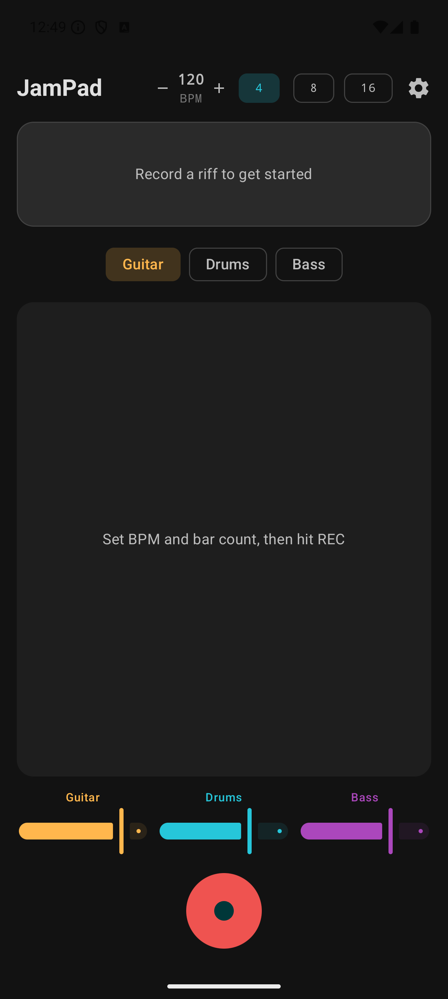
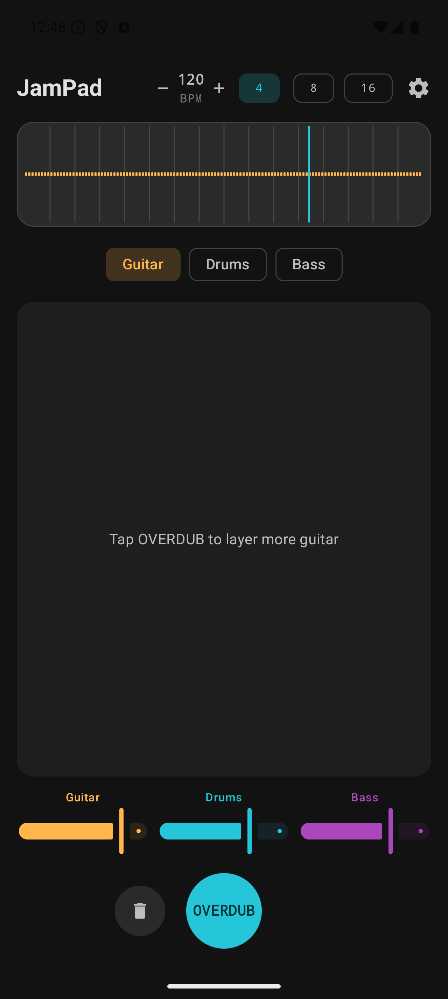
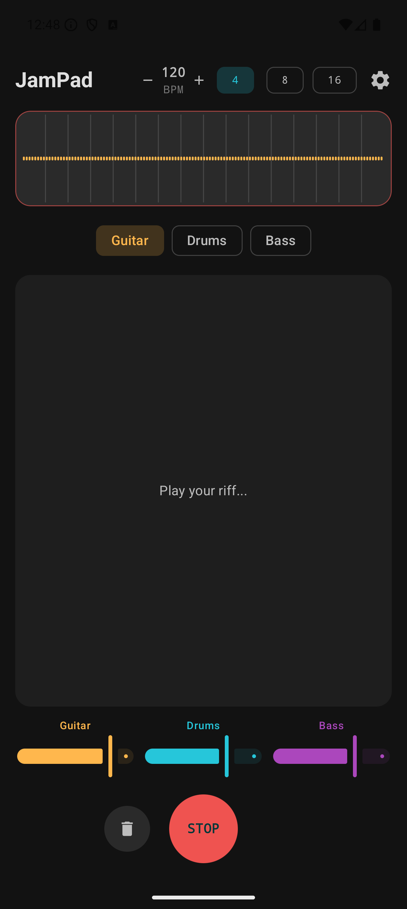
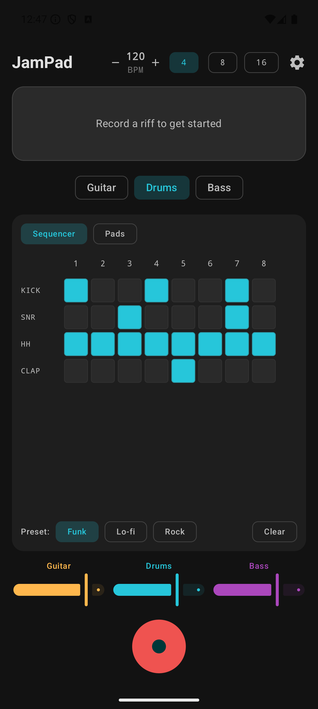
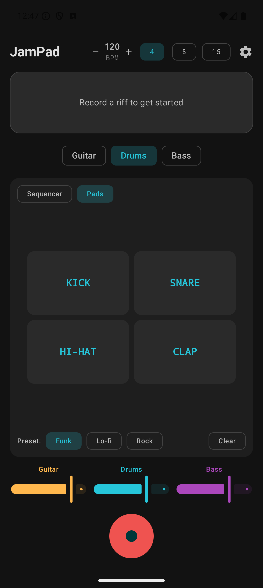
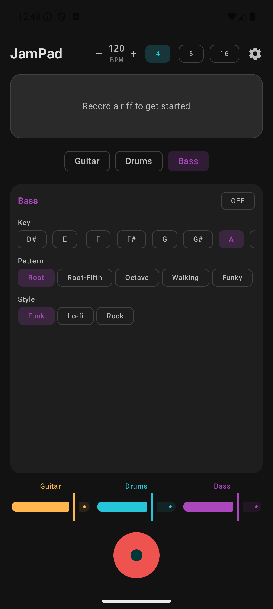

# JamPad

A single-screen loop station for Android. Record a guitar riff, layer digital drums and bass, and jam — all from your phone.

## Features

- **Audio Loop Engine** — Record, loop, and overdub guitar riffs with a tap of the Big Button
- **Waveform Visualization** — Live waveform display with animated playhead and beat markers
- **Drum Step Sequencer** — 8-step grid with Kick, Snare, Hi-Hat, and Clap across 3 preset styles (Funk, Lo-fi, Rock)
- **MPC-Style Drum Pads** — 2x2 tap pads with haptic feedback for live performance; hits record into the sequencer during playback
- **Bass Generator** — Synthesized bass lines with 5 pattern types (Root, Root-Fifth, Octave, Walking, Funky), 12-key selector, and 3 style presets
- **BPM Control** — Adjustable tempo (40–300 BPM) with +/- buttons
- **Bar Count** — Fixed loop lengths of 4, 8, or 16 bars
- **3-Channel Mixer** — Guitar, Drums, and Bass sliders with color-coded controls
- **Dark Theme** — Layer-coded accent colors: amber (guitar), cyan (drums), purple (bass)

## Screenshots

<p align="center">
  
  
  
</p>

<p align="center">
  
  
  
</p>

## Tech Stack

- **Language:** Kotlin
- **UI:** Jetpack Compose + Material 3
- **Architecture:** Clean Architecture (MVVM)
- **DI:** Hilt
- **Async:** Coroutines + StateFlow
- **Audio:** AudioRecord (recording) + AudioTrack (playback/synthesis)
- **Min SDK:** 26 (Android 8.0)
- **Target SDK:** 35

## Build

```bash
./gradlew assembleDebug
```

## Roadmap

| Milestone | Status |
|---|---|
| Scaffold & foundation | Done |
| Audio loop engine | Done |
| Tempo & key detection | Pending |
| Drum step sequencer | Done |
| Drum tap pads | Done |
| Bass generator | Done |
| Mixer & layering | Pending |
| Export (WAV/MP3) | Pending |
| Session persistence | Pending |
| Polish & release | Pending |

## License

MIT
